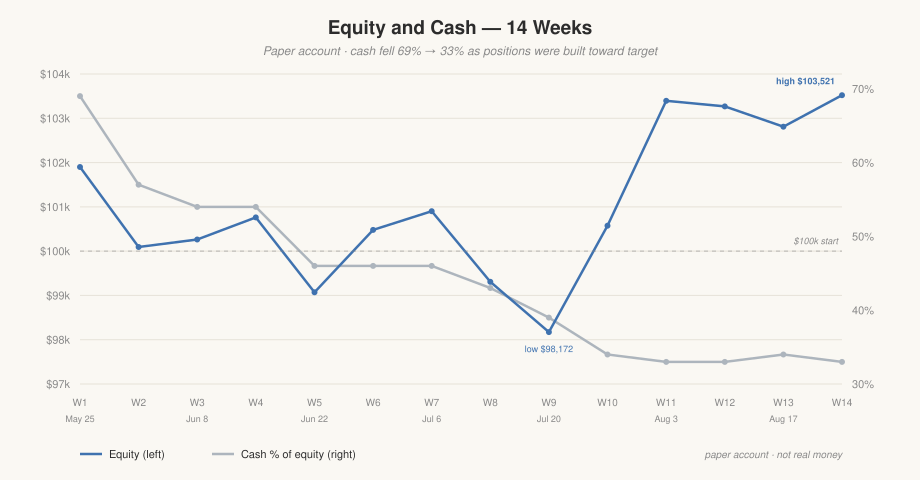

# Weekly Outcome — 14 weeks on a paper account

Fourteen consecutive weeks of this system running end to end: suggesting orders, placing
the accepted ones, and reporting what happened. Two images per week — a **stats card**
(equity, the suggestion funnel, cash) and a **current vs target allocation** chart.

> **Paper account. Not real money.** Every figure comes from an Alpaca **paper** account,
> which starts at $100,000 of simulated cash. These images show what the system does and
> how it behaves, not an investment track record — fourteen weeks is far too short to be
> one either way. Nothing here is financial advice. This build cannot connect to a live
> brokerage account at all; see [ADR-0036](../adr/0036-paper-only-public-build.md).



## The arc

Equity ran from $101,900 (week 1) to $103,521 (week 14) — **+3.5% over 14 weeks**, with a
dip to $98,172 in week 9. The more interesting number is the second one: **band coverage
went from 0/10 holdings inside their target band to 5/10**, peaking at 7/10 in week 12,
while cash fell from 69% to 33% of equity. The system was built to close allocation gaps,
not to beat the market, and that is the axis the images actually move along.

Three things worth noticing, because they are the parts a demo usually hides:

- **Weeks 4, 6 and 7 filled nothing at all.** Limits were set at support levels and the
  market drifted up past them. Week 7's card says so plainly: *"3rd zero-fill week in last
  4."* A suggest-only system that places limit orders at support will do this.
- **The gains have stopped coming from trading.** Cash has sat at $34,556 for four
  consecutive weeks (11–14) — the system has bought nothing in a month. The +$2,946 since
  the week-10 close is entirely appreciation on positions already held.
- **The last five percentage points of drift are the hard ones.** Band coverage has sat at
  5/10 since week 10 and has not improved. The three largest gaps — TQQQ at 0.7% against a
  10% target, MU at 0.0% against 5%, VOO 4.5pp light — are exactly the ones a
  buy-at-support strategy struggles to close in a market that keeps rising.

## Index

Newest first. Each row links both views for that week.

| Week | Dates | Equity | vs prior | Views | What it shows |
|---|---|---|---|---|---|
| 14 | Aug 24–28 | $103,521 | +$712 | [stats](week_14_stats_card.png) · [allocation](week_14_current_vs_target.png) | **New series high.** A fourth straight week with cash unchanged — the gain is all appreciation. Band coverage still 5/10; MSFT drifting further above target at 5.5%. VIX 14.4, F&G 54 (out of greed). |
| 13 | Aug 17–21 | $102,809 | −$460 | [stats](week_13_stats_card.png) · [allocation](week_13_current_vs_target.png) | Band coverage slipped 7/10 → 5/10; QQQ and ISRG drifted just under their floors. VIX 15.1, F&G 55. |
| 12 | Aug 10–14 | $103,269 | −$126 | [stats](week_12_stats_card.png) · [allocation](week_12_current_vs_target.png) | **Best band coverage of the series, 7/10.** QQQ crossed into band; ISRG returned after its July earnings drop. VIX 14.2, a series low. |
| 11 | Aug 3–7 | $103,395 | +$2,820 | [stats](week_11_stats_card.png) · [allocation](week_11_current_vs_target.png) | **Biggest single-week gain of the series — with no trades at all.** Cash unchanged; pure appreciation. First greed reading (F&G 63) in 11 weeks. |
| 10 | Jul 27–31 | $100,575 | +$2,403 | [stats](week_10_stats_card.png) · [allocation](week_10_current_vs_target.png) | Back above $100K. VOO closed the most ground (17.9% → 20.4%); MSFT first holding to reach target. |
| 9 | Jul 20–24 | $98,172 | −$1,136 | [stats](week_09_stats_card.png) · [allocation](week_09_current_vs_target.png) | **Series low**, −$1,828 against day 0. VIX 18.5, F&G 39. Card format changes here to invested/cash/band coverage. |
| 8 | Jul 13–17 | $99,308 | −$1,593 | [stats](week_08_stats_card.png) · [allocation](week_08_current_vs_target.png) | QQQ filled $715, breaking a 3-week zero-fill streak. Top-up feature ships — 5 fear-scaled in-band top-ups queued. |
| 7 | Jul 6–10 | $100,901 | +$422 | [stats](week_07_stats_card.png) · [allocation](week_07_current_vs_target.png) | **Third zero-fill week in four.** 4 suggested → 3 accepted → 0 filled; limits sat at support while markets drifted up. |
| 6 | Jun 29–Jul 3 | $100,479 | +$1,408 | [stats](week_06_stats_card.png) · [allocation](week_06_current_vs_target.png) | Back above $100K on zero fills — positions appreciated. TQQQ expired under the "QQQ near MA-200" hold rule. |
| 5 | Jun 22–26 | $99,071 | −$1,691 | [stats](week_05_stats_card.png) · [allocation](week_05_current_vs_target.png) | First time below $100K, at F&G 24 (extreme fear). VOO finally filled big: 10.9% → 17.6% of equity. |
| 4 | Jun 15–19 | $100,762 | +$500 | [stats](week_04_stats_card.png) · [allocation](week_04_current_vs_target.png) | 6 suggested, 6 accepted, **0 filled** — Fed held and a ceasefire rally lifted prices past every limit. |
| 3 | Jun 8–12 | $100,262 | +$168 | [stats](week_03_stats_card.png) · [allocation](week_03_current_vs_target.png) | First realised PnL: $10.36. Limits set deep at support; markets bounced and 4 of 6 didn't fill. |
| 2 | Jun 1–5 | $100,094 | −$1,806 | [stats](week_02_stats_card.png) · [allocation](week_02_current_vs_target.png) | Building positions through a selloff — 8 suggested → 6 accepted → 4 filled, the highest fill count of the series. |
| 1 | May 25–29 | $101,900 | — | [stats](week_01_stats_card.png) · [allocation](week_01_current_vs_target.png) | Day 0 baseline. 69% cash, VOO and MU at 0.0%, every holding under target. The "before" picture — and the positions already there are test-order residue, not choices (see notes). |

## Notes on reading these

- **Nothing held at week 1 was an allocation decision.** Every position already on the
  books when the series starts — QQQ at 14.5%, MSFT at 4.4%, and the small BRK.B, AMZN,
  ISRG, BTC and GOOG holdings — was placed and filled while testing the app during
  development. Those are test orders, not choices. Week 1 is simply the first week the
  system ran as intended; it is a starting *state*, not a designed portfolio, and the
  drift shown against target in that first chart is mostly an artifact of how testing
  happened to leave things.
- **"auto-trade LIVE"** on the week 1–8 cards means the auto-trade *mode* is `LIVE` rather
  than `OFF` or `DRY_RUN` — the third rung of the promotion ladder in
  [ADR-0014](../adr/0014-auto-trade-mode-discipline.md). It is a paper account throughout.
  Nothing here ever touched real money.
- The card layout changes at week 9, from a suggested → accepted → filled funnel to
  invested/cash/band-coverage plus VIX and Fear & Greed.
- Targets in the allocation charts match [`config/targets.yaml`](../../config/targets.yaml)
  — VOO and QQQ at 25%, TQQQ at 10%, the rest at 5%, against a 5% cash buffer.

## Adding a new one

Name files `week_NN_<view>.png` with the week number zero-padded to two digits, so `ls` and
GitHub's file listing both order them correctly. Then add a row at the top of the table.

To refresh the chart above, append the week's equity and cash % to `WEEKS` in
[`scripts/plot_weekly_series.py`](../../scripts/plot_weekly_series.py) and re-run it:

```bash
uv run python scripts/plot_weekly_series.py
```

It is standard library only — no plotting dependency — and rewrites `equity-and-cash.svg`
in place. The high/low annotations are derived from the data, so they follow automatically.
